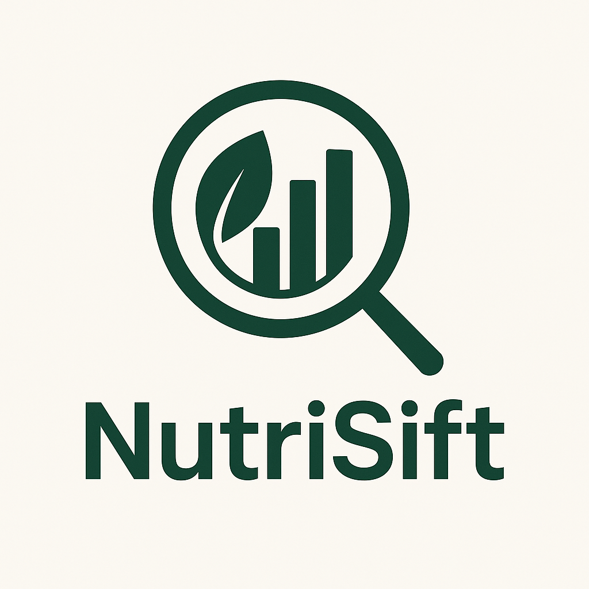

# NutriSift - AI-Powered Recipe Management Platform
<!-- GitAds-Verify: KGUU4F9BHPZVOJ9BCRE1RY3Q64Q6AA3V -->



## 📋 Overview

NutriSift is a comprehensive AI-powered recipe management ecosystem that transforms how individuals interact with food and nutrition. Leveraging the advanced Cohere command-a-03-2025 model, NutriSift addresses multiple pain points in the modern kitchen: ingredient wastage, dietary adherence, meal planning complexity, and nutritional tracking.

At its core, NutriSift employs artificial intelligence to analyze available ingredients and generate customized recipes tailored to users' dietary preferences, nutritional requirements, and taste preferences. Unlike conventional recipe databases, NutriSift's AI engine understands ingredient combinations, cooking techniques, and flavor profiles to create original, nutritionally balanced recipes optimized for the user's specific needs.

The platform's architecture integrates seven key components:

1. **AI Recipe Generation Engine**: Creates detailed recipes from user-provided ingredients with comprehensive nutritional analysis using cohere command-a-03-2025 model.
2. **Smart Recipe Discovery System**: Offers advanced filtering across multiple dimensions (calories, diet types, cuisines).
3. **Personal Recipe Library**: Enables users to build and organize their culinary collection.
4. **Comprehensive Meal Planning**: Develops personalized 7-day meal plans with nutritional balance and ingredient optimization based on health metrics and dietary needs.
5. **Intelligent Grocery Management**: Converts recipes into categorized shopping list.
6. **Personalized Profile System**: Adapts recommendations based on health metrics, dietary needs, and preferences.
7. **Location-Based Restaurant Finder**: Bridges home cooking with dining options for a complete food management experience.

NutriSift's React-based frontend delivers a responsive, intuitive interface accessible across devices, while the Spring Boot backend provides secure API endpoints for persistent data storage in MariaDB. Through JWT authentication and encrypted communication of important data, NutriSift maintains data security while enabling cloud synchronization.

The platform addresses the needs of health-conscious individuals, busy professionals, dietary-restricted users, and culinary enthusiasts by combining convenience with nutritional intelligence. NutriSift's ability to understand relationships between ingredients, suggest substitutions, and optimize grocery shopping represents a significant advancement beyond traditional recipe applications.

By integrating AI-powered recipe generation with comprehensive meal planning and grocery management, NutriSift creates a cohesive system that reduces food waste, promotes dietary adherence, simplifies meal preparation, and enhances nutritional awareness—ultimately transforming the relationship between users and their food choices.

## ✨ Key Features

### 🤖 AI Recipe Generation
- **Ingredient-Based Recipe Creation**: Enter ingredients you have on hand and receive complete recipe suggestions
- **Nutritional Analysis**: Get comprehensive nutrition information for every recipe
- **Dietary Awareness**: All recipes include diet type classifications (keto, vegan, etc.)
- **Origin & Classification**: Recipes include details about cuisine origin and course type
- **Conversational Interface**: Chat-like experience for requesting and refining recipes

### 🔍 Recipe Discovery System
- **Advanced Filtering**: Find recipes based on:
  - Calorie ranges (under 300, 300-500, 500-800, over 800 calories)
  - Diet types (vegetarian, vegan, gluten-free, keto, paleo, etc.)
  - Origins (Mediterranean, Asian, European, American, etc.)
  - Course types (breakfast, lunch, dinner, appetizer, dessert, etc.)
  - Cuisine styles (traditional, fusion, street food, gourmet, etc.)
- **Comprehensive Search**: Full-text search across recipe titles and ingredients
- **Visual Gallery**: Browse recipes with high-quality preview images

### 📚 Recipe Management
- **Personal Library**: Save unlimited recipes to your personal collection
- **Custom Organization**: Categorize and tag recipes for easy retrieval
- **Favorites Marking**: Mark top recipes as favorites for quick access
- **Search & Filter**: Quickly find saved recipes with powerful search functionality

### 🛒 Smart Grocery List
- **One-Click Adding**: Add all ingredients from a recipe to your grocery list
- **Quantity Adjustment**: Adjust quantities based on serving sizes
- **Checklist Functionality**: Check off items while shopping
- **Persistence**: List saves between sessions
- **Cloud Synchronization**: Access your grocery list across devices
- **Print & Share**: Print your grocery list or share it with others

### 📆 Personalized Weekly Meal Planning

NutriSift's AI-powered weekly meal planner creates customized 7-day meal plans tailored to your:

- **Dietary preferences** (vegetarian, vegan, keto, etc.)
- **Health goals** (weight loss, muscle gain, maintenance)
- **Calorie targets** (automatically calculated or custom)
- **Food allergies and restrictions**
- **Regional cuisine preferences**
- **Personal taste preferences**

#### Key Meal Planning Features:

- **Complete 7-Day Coverage**: Full meal plans with breakfast, morning snack, lunch, afternoon snack, and dinner for each day
- **Recipe Variety**: AI ensures diverse meals throughout the week with minimal repetition
- **Nutritional Balance**: Each day's plan maintains appropriate caloric and macronutrient distribution
- **Ingredient Optimization**: Efficient use of ingredients to reduce waste
- **Location Awareness**: Incorporates local and regional cuisine based on your location
- **Multiple Plan Management**: Save and access previous meal plans

#### Meal Plan Actions:

- **One-Click Generation**: Create new plans with a single click
- **Recipe Details**: Drill down into any meal for detailed information
- **Grocery List Integration**: Add entire days or specific meals to your grocery list
- **Interactive Management**: Edit, delete or save meal plans in your collection

## 🛠️ Technology Stack

### Frontend
- **React.js**: Core UI library for building component-based interfaces
- **React Router**: Advanced routing with HashRouter for GitHub Pages compatibility
- **Context API**: Global state management for user data and preferences
- **React Hooks**: Functional component state and lifecycle management
- **LocalStorage API**: Client-side data persistence
- **SessionStorage API**: Temporary session data management

### Backend
- **Spring Boot**: Java-based backend framework
- **Spring MVC**: RESTful API controllers
- **JDBC Template**: Database operations
- **BCrypt**: Password encryption
- **Spring Security**: Authentication handling
- **Cohere API Integration**: AI recipe generation with command-a-03-2025 model

### Database
- **MySQL/MariaDB**: Relational database for data persistence
- **Entity Tables**:
  - `users`: User account information and security questions
  - `saved_recipe`: Stored user recipes with nutritional data
  - `grocery_list`: User grocery items with categories
  - `recipe_logs`: History of recipe generation requests
  - `meal_plans`: Weekly meal planning data
  - `profile`: User profile and preferences
  - `api_usage_logs`: API request tracking

### External APIs
- **Cohere API**: AI-powered recipe generation
- **Pixabay API**: High-quality recipe images
- **OpenStreetMap**: Restaurant location data

## 📦 Installation & Setup

### Prerequisites
- Node.js (v14.0.0 or later)
- npm (v6.0.0 or later)
- Java 17 or later
- Maven
- MySQL/MariaDB Database

### Frontend Setup

1. **Clone the repository**:
   ```bash
   git clone https://github.com/Shubhodippal/NutriSift.git
   cd nutri-sift/Frontend
   ```

2. **Install dependencies**:
   ```bash
   npm install
   ```

3. **Create environment variables**:
   Create a .env file in the root directory with the following content:
   ```
   REACT_APP_PIXABAY_API_KEY=your_pixabay_api_key_here
   REACT_APP_API_BASE_URL=http://localhost:8080
   REACT_APP_RECIPE_SEARCH_ENDPOINT=/recipe/search
   REACT_APP_API_KEY_HEADER=your_api_key_header
   REACT_APP_API_KEY=your_api_key_value
   ```

4. **Start the development server**:
   ```bash
   npm start
   ```

5. **Build for production**:
   ```bash
   npm run build
   ```

### Backend Setup

1. **Navigate to the backend directory**:
   ```bash
   cd nutri-sift/Backend/demo
   ```

2. **Create the application properties file**:
   `src/main/resources/application.properties`:
   ```
   spring.application.name=Nutrisift
   spring.datasource.url=jdbc:mariadb://<DB_HOST>:<DB_PORT>/<DB_NAME>
   spring.datasource.username=<DB_USERNAME>
   spring.datasource.password=<DB_PASSWORD>
   spring.datasource.driver-class-name=org.mariadb.jdbc.Driver
   spring.jpa.show-sql=true
   
   spring.jpa.hibernate.ddl-auto=none
   spring.jpa.properties.hibernate.dialect=org.hibernate.dialect.MariaDBDialect
   
   # JWT Configuration
   jwt.secret=<YOUR_JWT_SECRET>
   jwt.expiration=86400000
   
   # Allow connections from external devices
   server.address=0.0.0.0
   
   # Cohere API Key
   cohere.api.key=<YOUR_COHERE_API_KEY>

   # Email Configuration
   email.host=outgoing_server
   email.port=port_number
   email.username=web_mail_id
   email.password=web_mail_password
   email.ssl=true

   # Add this to your existing properties
   api.key=your_api_key_value
   api.header.name=your_api_key_header
   ```

3. **Build the application**:
   ```bash
   mvn clean package
   ```

4. **Run the application**:
   ```bash
   java -jar target/demo-0.0.1-SNAPSHOT.jar
   ```

### Database Setup

1. **Install and Configure MariaDB/MySQL**:
   ```bash
   # For Ubuntu/Debian
   sudo apt update
   sudo apt install mariadb-server
   
   # For Windows
   # Download and install from https://mariadb.org/download/
   ```

2. **Secure your installation**:
   ```bash
   sudo mysql_secure_installation
   ```

3. **Create the database and user**:
   ```sql
   CREATE DATABASE NUTRISIFT;
   CREATE USER 'nutrisift_user'@'localhost' IDENTIFIED BY 'your_strong_password';
   GRANT ALL PRIVILEGES ON NUTRISIFT.* TO 'nutrisift_user'@'localhost';
   FLUSH PRIVILEGES;
   ```

4. **Import the schema**:
   ```bash
   mysql -u nutrisift_user -p NUTRISIFT < nutrisift_schema.sql
   ```

## 📡 API Documentation

### User Authentication
- `POST /users/register` - Register new user
- `POST /users/login` - User login
- `GET /users/security-question?email={email}` - Get security question for password recovery
- `POST /users/verify-answer` - Verify security question answer
- `POST /users/reset-password` - Reset user password
- `POST /users/refresh-token` - Refresh JWT token
- `POST /users/otp` - Generate one-time password

### Recipe Management
- `POST /recipe` - Generate recipe from ingredients using AI
- `POST /recipe/search` - Search for recipes with filters
- `GET /recipes/{id}` - Get recipe by ID
- `GET /recipe/user/{uid}` - Get all saved recipes for a user
- `POST /recipe/save` - Save a recipe
- `DELETE /recipe/{id}` - Delete a recipe
- `POST /recipe/meal-plan` - Generate weekly meal plan
- `GET /recipe/meal-plans/{uid}/{mail}` - Get user's meal plans
- `DELETE /recipe/del_meal-plan/{id}` - Delete a meal plan

### Grocery List Management
- `GET /grocerylist/{userId}` - Get user's grocery list
- `POST /grocerylist/{userId}` - Save grocery list
- `DELETE /grocerylist/{userId}` - Delete grocery list
- `PUT /grocerylist/item/{itemId}` - Update grocery item
- `DELETE /grocerylist/item/{itemId}` - Delete grocery item

### User Profile
- `POST /users/profile` - Create user profile
- `GET /users/profile/{email}` - Get user profile
- `PUT /users/profile/{email}` - Update user profile

## 📱 Detailed Usage Guide

### Home Page
The home page serves as the central hub for navigating the application:
- Access key features through visual navigation cards
- View recently accessed recipes
- Manage your account

### Recipe Chat
The AI-powered recipe generation interface:
1. Begin by entering ingredients you have available
2. Receive a complete recipe with:
   - Recipe title and description
   - Ingredient list with quantities
   - Step-by-step instructions
   - Nutritional information
   - Origin and cuisine type
3. Save, print, or share the recipe

### Discover Recipes
Browse and search for recipes with advanced filtering:
1. Use the search bar for recipes with specific ingridients
2. Filter by calorie range, diet type, origin, course, and cuisine style
3. View results in a visual grid
4. Perform actions like saving, viewing details, or adding to grocery list

### Saved Recipes
Your personal recipe library:
1. View your collection of saved recipe
2. Search your saved recipes
3. Perform actions on your recipes like viewing details, or adding to grocery list

### Grocery List
Intelligent shopping assistant:
1. View items by category
2. Check/uncheck items as you shop
3. Edit quantities or add custom items
4. Print or share your list
5. Access your list across devices
6. Manage grocery list (edit, print, check, delete)

### Profile Details
Complete your personal profile for personalized recommendations:
1. Enter basic information (name, weight, height, gender, date of birth)
2. Specify your dietary preferences (vegetarian, vegan, keto, etc.)
3. Set your body goals (weight loss, maintenance, muscle gain)
4. List food allergies and restrictions
5. Provide location information for localized recommendations

### Personalized Meal Planner
AI-powered weekly meal planning customized to your profile:
1. Generate complete 7-day meal plans with breakfast, lunch, dinner and snacks
2. View nutritionally balanced meals tailored to your dietary preferences
3. Access meal details including ingredients, instructions, and nutritional information
4. Save, print, or share individual recipes
5. Add ingredients directly to your grocery list
6. Manage multiple meal plans (save, print, delete)
7. Cycle through previous plans to reuse favorite combinations

### Nearby Restaurants
Discover dining options in your vicinity:
1. View interactive map showing restaurants near your location
2. Filter by restaurant type (general, fast food, café, etc.)
3. Adjust search radius to expand or narrow your options
4. View details for each restaurant (name, distance, address)
5. Access restaurant direction
6. Enter location manually if GPS is inaccurate

## 💻 Development Guide

### Available Scripts

#### Frontend
- `npm start` - Run the development server on http://localhost:3000
- `npm test` - Launch the test runner
- `npm run build` - Build the app for production to the build folder

#### Backend
- `mvn spring-boot:run` - Run the Spring Boot application on http://localhost:8080
- `mvn clean package` - Build the application


## 📜 License

This software is licensed under a **Non-Commercial License**.  
You are free to use, copy, and modify it for personal, educational, and research purposes.  
**Commercial use is strictly prohibited.**  
See the LICENSE file for full terms.

## 👨‍💻 Developed By

NutriSift was designed and developed by Shubhodip Pal.

GitHub: [Shubhodippal](https://github.com/Shubhodippal)  
LinkedIn: [Shubhodip Pal](https://www.linkedin.com/in/shubhodip-pal/)  
Email: shubhodippal01@gmail.com

## 👥 Contributing

Contributions are welcome! Please feel free to submit a Pull Request.

For major changes, please open an issue first to discuss what you would like to change.

## ⚠️ Disclaimer

Recipe images and restaurant images are provided for reference only and may not exactly match the reality. Nutritional information is approximate and should not be used for medical purposes. Always verify ingredients for allergens and dietary restrictions. NutriSift is not responsible for any adverse reactions to recipes or cooking mishaps.
